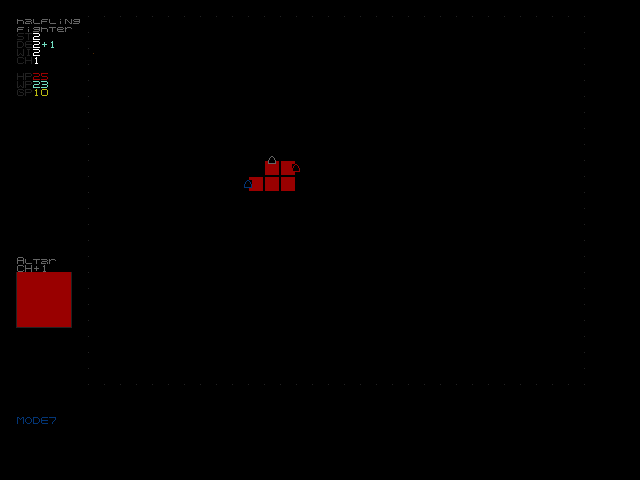

# SkeletonCavern


## player.character file

The program loads a file named `player.character` from the current directory.  Edit this file to alter your character's starting stats.  The file format is like:

```
strength=2
dexterity=1
charisma=1
wits=2
class=wizard
race=halfling
```

## Credits

* Skeleton Cavern is copyright Noah Patterson
  * [microrpg.weebly.com](https://microrpg.weebly.com/)
  * [www.drivethrurpg.com/product/306726/Skeleton-Cavern-A-Micro-Chapbook-RPG](https://www.drivethrurpg.com/product/306726/Skeleton-Cavern-A-Micro-Chapbook-RPG)
* much borrowed C code is copyright Devine Lu Linvega
  * [git.sr.ht/~rabbits/left](https://git.sr.ht/~rabbits/left)